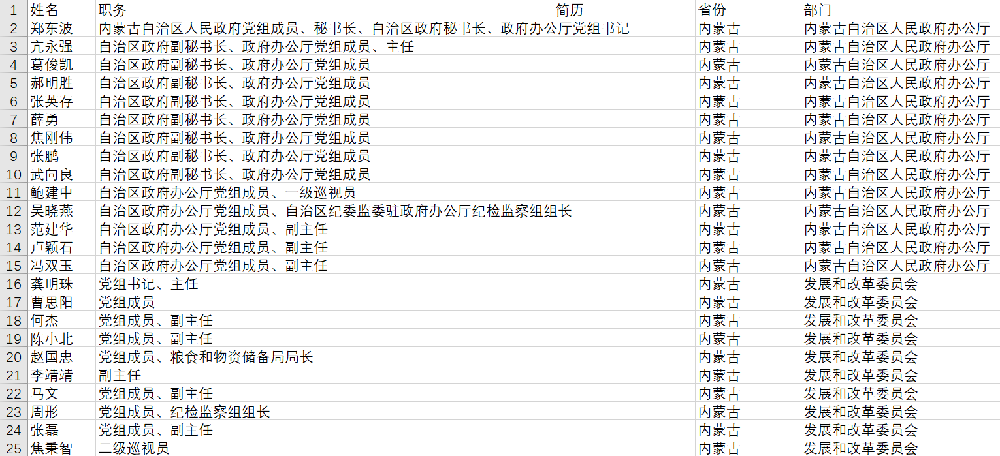
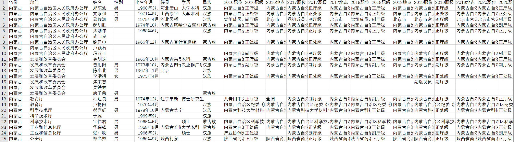

# Government Officials Career Path Crawler

A specialized crawler system designed to track and analyze the career progression of Chinese government officials at or above the department level (厅级及以上) by combining data from government websites and Baidu Baike.

## System Overview

This project consists of two main components:
1. `gov_crawler.py`: Extracts basic official information from government websites
2. `baike_crawler.py`: Enriches official data with detailed career progression from Baidu Baike

### Government Website Crawler Output

*Sample output from gov_crawler.py showing basic official information*

### Baidu Baike Enriched Data

*Sample output from baike_crawler.py showing detailed career progression by year*

## Features

### Data Enrichment
- Tracks career changes from 2016 to 2024
- Automatically determines official ranks for each position
- Validates and merges information from multiple sources
- Maintains chronological career progression

### Anti-Crawling Measures
- Dynamic IP proxy pool integration
- Random User-Agent rotation
- Intelligent request delays
- Retry mechanism with exponential backoff

### Content Processing
- Smart HTML cleaning using regex patterns
- Semantic-based content extraction
- Large text chunk processing
- Intelligent split point selection for content handling

## Prerequisites

### Required Python Packages
```bash
pip install -r requirements.txt
```

### Required APIs
1. DeepSeek API
   - Purpose: Text analysis and information extraction
   - Registration: recommand https://www.volcengine.com/ (->faster response)
   or officially https://platform.deepseek.com
   
2. KuaiDaili API
   - Purpose: IP proxy pool
   - Registration: https://www.kuaidaili.com
   
3. BochaaI API
   - Purpose: Web search functionality (when the first person in baike is not the leader we want)
   - Registration: https://api.bochaai.com

## Configuration

Update the following in the Config class in baike_crawler.py:
```python
class Config:
    GPT_API_KEY = "your_deepseek_api_key"
    BOCHAAI_API_KEY = "your_bochaai_api_key"
    
    INPUT_EXCEL = "./results/XX领导爬取.csv"
    OUTPUT_EXCEL = "./results/XX领导百度百科爬取.csv"
    FAILED_LOG = "./results/baike_failed_records.txt"

    # KuaiDaili Proxy Configuration
    PROXY_SECRET_ID = "your_kuaidaili_secret_id"
    PROXY_SIGNATURE = "your_kuaidaili_signature"
    PROXY_USERNAME = "your_kuaidaili_username"
    PROXY_PASSWORD = "your_kuaidaili_password"
```

Update the following in gov_crawler.py:
```python
# Main execution parameters
api_key = "your_deepseek_api_key"
model = "deepseek-v3-241226"
chunk_size = 50000  # Content processing chunk size
max_depth = 4       # Maximum depth for recursive search
initial_url = "https://www.gov.cn/home/2023-03/29/content_5748954.htm"
target_provinces = ["target_province_name"]
folder = './results'
```

## Usage

### 1. Initial Data Collection
```bash
python gov_crawler.py
```
This will create a CSV file with basic official information.

### 2. Data Enrichment
```bash
python baike_crawler.py
```
This will enrich the initial data with detailed career progression information.

## Output Format

### Final CSV Structure
- Basic Information:
  - Name
  - Current Position
  - Province
  - Department
  - Gender
  - Birth Date
  - Native Place
  - Education
  - Ethnicity
- Career Progression (2016-2024):
  - Position
  - Rank Level
  - Location

## Technical Highlights

### 1. Intelligent Content Processing
- Smart HTML cleaning with regex
- Semantic analysis for content relevance
- Chunked processing for large texts
- URL normalization and validation

### 2. Data Accuracy
- Cross-validation between sources
- GPT-assisted content verification
- Intelligent rank level determination
- Duplicate information merging

### 3. Error Handling
- Comprehensive exception management
- Failed record logging
- Automatic retry mechanism
- Result validation

## Best Practices
1. Respect website robots.txt rules
2. Set appropriate request intervals
3. Regularly update proxy IPs
4. Back up data periodically
5. Monitor API usage quotas

## Limitations
- Requires active API subscriptions
- Chinese government websites only

## Contributing
Issues and Pull Requests are welcome
